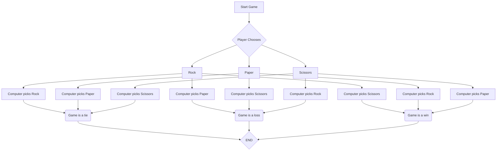

> [!NOTE]
> Arrows that connect to nodes only connect in the middle of one of its four sides, so some nodes pass through blocks they are not connected to. I tried to increase the spacing but I could not figure it out.

1. B --> C, D, E
   - ***C**, **D**, and **E** are the three different choices the player can pick (rock, paper, and scissors, respectively.*
2. C --> F, G, H; D --> I, J, K; E --> L, M, N
   - *These all represent rock, paper, and scissors respectively connecting to the computer picks for rock, paper, and scissors respectively*
3. F, J, N --> O; G, K, L --> P; H, I, M --> Q
   - *This connects the tie, loss, and win conditions to the choices that result in either a tie, win, or loss.*
